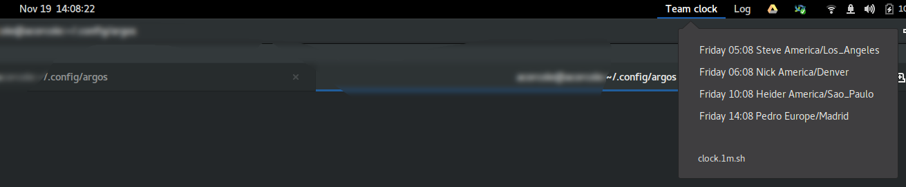

# xbar-team-clock

A quick xbar/Argos plugin to show a customizable world clock in your title bar.
I have only tested this with Argos (for Gnome Shell).



## Requirements

* Python 3
* A suitable extension like:
  * https://github.com/p-e-w/argos . The extension on https://extensions.gnome.org/extension/1176/argos/ has not been updated for newer Gnome versions. At the time of writing this, Fedora 37 contains a `gnome-shell-extension-argos` package.
* Probably Gnu CoreUtils or something, so `TZ=xxx date +"%A %H:%M"` works. I would prefer to use native Python for portability, but I think that would require `zoneinfo`, added in Python 3.9.

## Usage

Create a file called `clock.1m.sh` with contents like: 
 
```
#!/path/to/xbar-team-clock/team-clock.py
Steve;America/Los_Angeles
Nick;America/Denver
Heider;America/Sao_Paulo
Pedro;Europe/Madrid
```

* The first line is a shebang pointing to the `team-clock.py` script
* Every other non-blank line is a clock you want, using the format `text;tz`, where `text` is the text you want to display, and `tz` is the time zone.
* Lines starting with `#` are ignored

Make the file executable and drop it in `~/.config/argos/` (for Argos).
